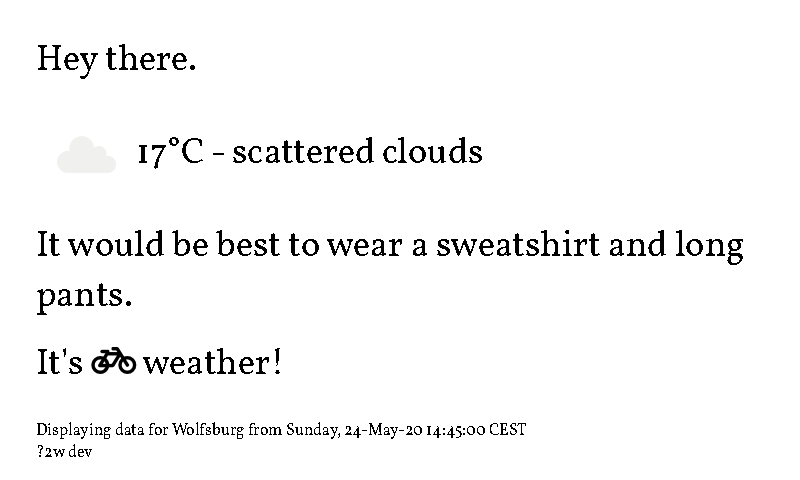

# what-to-wear
what-to-wear is a service that periodically queries the openweathermap-API to get the latest weather data and generates a dynamic info display.

Together with [ePaperDisplay](https://github.com/dschanoeh/ePaperDisplay) it can be used as an e paper weather display.

The user can specify messages to be displayed based on weather criteria. Conditions are evaluated using the [Expr expression language](https://github.com/antonmedv/expr).



## Installation
Besides the what-to-wear binary, a Chrome installation is required on the host.

## Configuring
An example configuration can be found [here](https://github.com/dschanoeh/what-to-wear/blob/master/examples/config.yml).

Note that string expressions defined in the configuration file (such as message strings) require quotation marks to be evaluated by the expression language. Therefore, double quotations are required.

### Website
The file `templates/index.gohtml` is a templated HTML file representing the website. It can be modified to customize the view.

Any other files to be served (e.g. webfonts, images, ...) can be added in the `static` folder and referenced from the main template.

### Images
In addition to the website, the display data will also be available as image data. The images can either be received through http from the server or can be
pushed through MQTT.
Whenever an update is performed a headless Chrome instance will be used to render the display, process, and push the data.

### Messages
Messages can have conditions that determine if they are displayed or not:

```yaml
- message: >
      "Better bring an <i class='fas fa-umbrella'></i>."
    condition: "rain1h > 0.1"
```

Variables can be defined that that can be built into the message string. Variables have different choices which are evaluated top to bottom (in case the conditions overlap).

```yaml
- message: "'It would be best to wear a ' + top"
    variables:
      - name: "top"
        choices:
          - expression: "temperature > 20"
            value: "t-shirt"
          - expression: "temperature <= 20"
            value: "sweatshirt"
```
